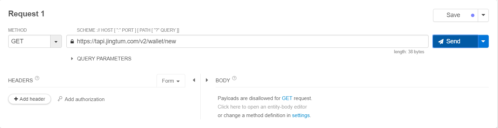
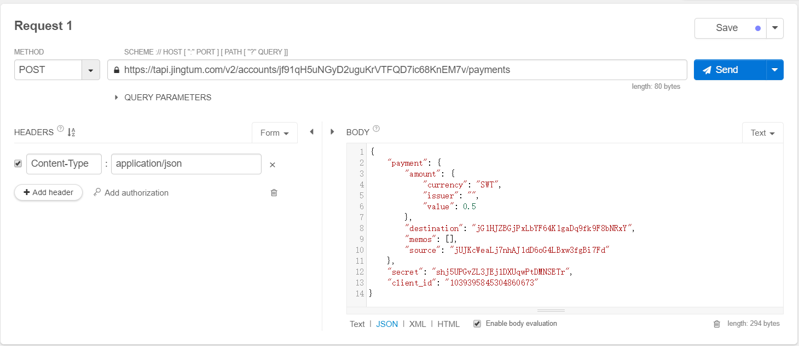

# Jingtum API使用教程

***

Jingtum API是井通科技提供的用于访问SWTC公链的RESTful API接口。通过Jingtum API，可以实现账户管理、支付、挂单、交易以及查询等基本功能。

## 一、通过HTTP访问调用API接口

- 第一步：安装PostmanAPI调试工具、Chrome浏览器的restlet插件或者其他类似的调试工具。

- 第二步：使用调试工具对Jingtum API的接口进行调用，接口调用分为GET请求和POST请求（请求地址、请求参数、请求返回结果参照本网站的[Jingtum API手册](https://penlylu-demo.readthedocs.io/en/latest/reference/jingtum-api/)）。

下面以Chrome浏览器的restlet client为例：

- 1、GET请求
  - Method: “GET”
  - SCHEME: “请求地址”
 
 
- 2、POST请求
  - Method: “POST”
  - SCHEME: “请求地址”
  - HEADERS: “CONTENT-TYPE：APPLICATION/JSON”
  - BODY: “请求的JSON字符串”
  

## 二、通过代码方式调用API接口

- 第一步：选用代码语言，如JAVA、PHP、C、GO等后端开发语言。

- 第二步：使用开发语言模拟HTTP请求实现对API接口的调用，接口调用分为GET请求和POST请求。

### Java

- 1、GET请求

```java
  package com.jingtum.api.test;
  import java.io.BufferedReader;
  import java.io.IOException;
  import java.io.InputStream;
  import java.io.InputStreamReader;
  import java.net.HttpURLConnection;
  import java.net.URL;
  public class TestApi {
    public static void main(String[] args) {
      //创建账号
      String  url = "https://tapi.jingtum.com/v2/wallet/new";
      String result = get(url);
      System.out.println("支付请求结果："+result);
    }
    public static String get(String location) {
      HttpURLConnection conn = null;
      InputStream in = null;
      BufferedReader br = null;
      try {
        URL url = new URL(location);
        conn = (HttpURLConnection) url.openConnection();
        conn.setRequestMethod("GET");
        conn.setRequestProperty("contentType", "UTF-8");
        in = conn.getInputStream();
        br = new BufferedReader(new InputStreamReader(in, "UTF-8"));
        String lines;
        StringBuffer sb = new StringBuffer();
        while ((lines = br.readLine()) != null)
          sb.append(lines);
        return sb.toString();
      } catch (Exception e) {
        throw new RuntimeException(e);
      } finally {
        if (conn != null)
          conn.disconnect();
        if (in != null)
          try {
            in.close();
          } catch (IOException e) {
            e.printStackTrace();
          }
        if (br != null)
          try {
            br.close();
          } catch (IOException e) {
            e.printStackTrace();
          }
      }
    }
  }
```


- 2、POST请求

**注意**：POST请求时，头部为`application/json; charset=UTF-8`；

```java
package com.jingtum.api.test;
import java.io.BufferedReader;
import java.io.IOException;
import java.io.InputStream;
import java.io.InputStreamReader;
import java.io.OutputStreamWriter;
import java.io.PrintWriter;
import java.net.HttpURLConnection;
import java.net.URL;
import java.util.UUID;
import com.alibaba.fastjson.JSONObject;
import com.jingtum.api.util.HttpClient;
import com.jingtum.api.util.HttpClient.ContentType;

public class TestApi {
	
	public static void main(String[] args) {
		//创建账号
		String  url = "https://tapi.jingtum.com/v2/accounts/jNn89aY84G23onFXupUd7bkMode6aKYMt8/payments";
		JSONObject payment_item = new JSONObject();
		payment_item.put("secret", "spvFsSWaD1BmNk7h3Zvo98YRi1NxX");
		payment_item.put("client_id", UUID.randomUUID().toString());
			JSONObject payment = new JSONObject();
			payment.put("source", "jNn89aY84G23onFXupUd7bkMode6aKYMt8");
			payment.put("destination", "j9U7YWAHF7ksFLZn2keD5e6ckoKf4nxdZY");
				JSONObject destination_amount = new JSONObject();
				destination_amount.put("value", "25");
				destination_amount.put("currency", "SWT");
				destination_amount.put("issuer", "");
			payment.put("amount", destination_amount);
			String[] memos = {"String","账户激活"};
			payment.put("memos", memos);
		payment_item.put("payment", payment);
		System.out.println("激活请求参数："+payment_item.toJSONString());
		String result = post(url, payment_item.toJSONString());
		System.out.println("激活请求结果："+result);
	}
	
	public static String post(String location, String data) {
		HttpURLConnection conn = null;
		PrintWriter out = null;
		BufferedReader br = null;
		try {
			URL url = new URL(location);
			conn = (HttpURLConnection) url.openConnection();
			conn.setDoOutput(true);
			conn.setDoInput(true);
			conn.setRequestMethod("POST");
			conn.setUseCaches(false);
			conn.setInstanceFollowRedirects(true);
			conn.setRequestProperty("Content-Type", "application/json; charset=UTF-8");
			conn.connect();
			out = new PrintWriter(new OutputStreamWriter(conn.getOutputStream(), "UTF-8"));
			out.write(data);
			out.flush();
			br = new BufferedReader(new InputStreamReader(conn.getInputStream(), "UTF-8"));
			String lines;
			StringBuffer sb = new StringBuffer();
			while ((lines = br.readLine()) != null)
				sb.append(lines);
			return sb.toString();
		} catch (Exception e) {
			throw new RuntimeException(e);
		} finally {
			if (conn != null)
				conn.disconnect();
			if (br != null)
				try {
					br.close();
				} catch (IOException e) {
					e.printStackTrace();
				}
		}
	}
}
```

### Python

```python
import urllib.request
import urllib.parse
import json
import time
def http_get():
    url='https://tapi.jingtum.com/v2/wallet/new'
    response = urllib.request.urlopen(url)
    print(response.read().decode('utf-8'))
def http_post():	
	serverurl='https://tapi.jingtum.com/v2/accounts/jNn89aY84G23onFXupUd7bkMode6aKYMt8/payments'
	client_id = "id"+(str(time.time()))
	values ={
		"client_id" : client_id,
		"payment" : {
			"amount" : {
				"currency" : "SWT",
				"issuer" : "",
				"value" : "1"
			},
			"destination" : "j3UcBBbes7HFgmTLmGkEQQShM2jdHbdGAe",
			"memos" : [ "" ],
			"source" : "jNn89aY84G23onFXupUd7bkMode6aKYMt8"
		},
		"secret" : "spvFsSWaD1BmNk7h3Zvo98YRi1NxX"
	}
	jdata = json.dumps(values).encode()
	request = urllib.request.Request(serverurl, jdata)
	request.add_header('Content-Type','application/json')
	request.get_method = lambda:'POST'
	response = urllib.request.urlopen(request)
	print(response.read().decode('utf-8'))
	
http_get()  #get请求demo
http_post() #post请求demo
```

### PHP

```php
<?php

function http_get1(){
	$url='https://tapi.jingtum.com/v2/wallet/new';
	$result = file_get_contents($url);
	echo ($result);
}

function http_post1() {  
 
	$url = "https://tapi.jingtum.com/v2/accounts/jNn89aY84G23onFXupUd7bkMode6aKYMt8/payments";
	$cliend_id =strval(time());
	$data = json_encode(array('secret'=>"spvFsSWaD1BmNk7h3Zvo98YRi1NxX",'client_id'=>$cliend_id,'payment'=>array('source' =>'jNn89aY84G23onFXupUd7bkMode6aKYMt8','destination' =>'j3UcBBbes7HFgmTLmGkEQQShM2jdHbdGAe','amount' =>array('value' =>'1.00','currency' =>'SWT','issuer' =>''))));  

	$opts = array('http' => 
		  array( 
			  'method'  => 'POST',
			  'header'  => 'Content-type: application/json',
			  'content' => $data
		  )
	);
	$context = stream_context_create($opts); 
	$result = file_get_contents($url, false, $context);
	
	echo($result);
}  

http_get1();

http_post1();

?> 
```

### Go

```go
package main

import (
    "fmt"
    "encoding/json"
	"bytes"
	"io/ioutil"
	"net/http"
)

func httpGet(){
	resp, err := http.Get("https://tapi.jingtum.com/v2/wallet/new")
	if err != nil {
	// handle error
	}
	defer resp.Body.Close()
	body, err := ioutil.ReadAll(resp.Body)
	 
	if err != nil {
	// handle error
	}
	 
	fmt.Println(string(body))
}

func httpPost() {
    url := "https://tapi.jingtum.com/v2/accounts/jNn89aY84G23onFXupUd7bkMode6aKYMt8/payments"

    options := map[string]interface{}{"secret": "spvFsSWaD1BmNk7h3Zvo98YRi1NxX", "client_id": "aaaabbbb1", "payment": map[string]interface{}{"source":"jNn89aY84G23onFXupUd7bkMode6aKYMt8","destination":"j3UcBBbes7HFgmTLmGkEQQShM2jdHbdGAe","amount":map[string]interface{}{"value":"1.1","currency":"SWT","issuer":""}}}
	mjson,_ :=json.Marshal(options)
	mString :=string(mjson)
    jsonStr := []byte(mString)

    req, err := http.NewRequest("POST", url, bytes.NewBuffer(jsonStr))
    req.Header.Set("Content-Type", "application/json")
    
    client := &http.Client{}
    resp, err := client.Do(req)
    if err != nil {
        panic(err)
    }
    defer resp.Body.Close()

    fmt.Println("response Status:", resp.Status)
    fmt.Println("response Headers:", resp.Header)
    body, _ := ioutil.ReadAll(resp.Body)
    fmt.Println("response Body:", string(body))

}

func main() {

	httpGet()
	//httpPost()
}
```

### Node.js

```js
var https = require('https');

function http_get() {
	var url = "https://tapi.jingtum.com/v2/wallet/new";
	https.get(url, function(res) {
		console.log("statusCode: ", res.statusCode);
		console.log("headers: ", res.headers);
		var _data = '';
		res.on('data', function(chunk) {
			_data += chunk;
		});
		res.on('end', function() {
			console.log("\n--->>\ngetresult:", _data)
		});
	})

}
function http_post() {
	var client_id = "id" + new Date().getTime();
	var post_data = {
		"client_id" : client_id,
		"payment" : {
			"amount" : {
				"currency" : "SWT",
				"issuer" : "",
				"value" : "1"
			},
			"destination" : "j3UcBBbes7HFgmTLmGkEQQShM2jdHbdGAe",
			"memos" : [ "" ],
			"source" : "jNn89aY84G23onFXupUd7bkMode6aKYMt8"
		},
		"secret" : "spvFsSWaD1BmNk7h3Zvo98YRi1NxX"
	};
	var content = JSON.stringify(post_data);
	var options = {
		host : 'tapi.jingtum.com',
		port : 443,
		path : '/v2/accounts/jNn89aY84G23onFXupUd7bkMode6aKYMt8/payments',
		method : 'POST',
		headers : {
			'Content-Type' : 'application/json',
			'Content-Length' : content.length
		}
	};
	console.log("post options:\n", options);
	console.log("content:", content);
	console.log("\n");
	var req = https.request(options, function(res) {
		console.log("statusCode: ", res.statusCode);
		console.log("headers: ", res.headers);
		var _data = '';
		res.on('data', function(chunk) {
			_data += chunk;
		});
		res.on('end', function() {
			console.log("\n--->>\npostresult:", _data)
		});
	});
	req.write(content);
	req.end();
}
http_get();//get请求
//http_post();//post请求
```
