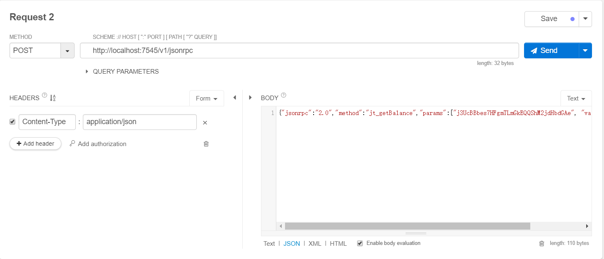

# Service节点使用教程

***

## 安装流程

- 第一步：根据用户环境下载skywell.node程序，分别为windows、mac、linux三个版本。

- 第二步：程序配置文件skywell.cfg修改访问节点地址。

- 第三步：启动程序。

  - Windows：cmd下执行 `skywell.node.exe -api -rpc`

  - Linux：`./skywell.node -api -rpci`

- 第四步：调用`JSON-RPC API`（详细请查询[Service节点手册](https://penlylu-demo.readthedocs.io/en/latest/reference/servicenode/)）。

## 通过HTTP访问调用API接口

下面以Chrome浏览器的restlet client为例：

  - Method:“POST”
  - SCHEME：“请求地址”
  - HEADERS：“CONTENT-TYPE：APPLICATION/JSON”
  - BODY：“请求的JSON字符串”
  
例：通过RPC获取最新区块编号

请求地址：`http://localhost:7545/v1/jsonrpc`

请求参数：`{"jsonrpc":"2.0","method":"jt_blockNumber","params":[],"id":1}`

请求结果：`{ "id":1, "jsonrpc": "2.0", "result": 112948, "status": "success" }`

 

## 通过代码方式调用API接口

使用开发语言模拟HTTP请求实现对JSON-RPC API的调用。

例：通过RPC获取最新区块编号

请求地址：`http://localhost:7545/v1/jsonrpc`

请求参数：`{"jsonrpc":"2.0","method":"jt_blockNumber","params":[],"id":1}`

请求结果：`{ "id":1, "jsonrpc": "2.0", "result": 112948, "status": "success" }`

**注意**：POST请求时，头部为`application/json; charset=UTF-8`；

```java
package com.jingtum.api.test;
import java.io.BufferedReader;
import java.io.IOException;
import java.io.InputStreamReader;
import java.io.OutputStreamWriter;
import java.io.PrintWriter;
import java.net.HttpURLConnection;
import java.net.URL;
import com.alibaba.fastjson.JSONObject;
public class TestApi {
	public static void main(String[] args) {
		//查询最新区块的编号
		String  url = "http://localhost:7545/v1/jsonrpc";
		JSONObject payment_item = new JSONObject();
		payment_item.put("jsonrpc", "2.0");
		payment_item.put("method", "jt_blockNumber");
		String[] params = {};
		payment_item.put("params", params);
		payment_item.put("id", 1);
		System.out.println("请求参数："+payment_item.toJSONString());
		String result = post(url, payment_item.toJSONString());
		System.out.println("请求结果："+result);
	}
	public static String post(String location, String data) {
		HttpURLConnection conn = null;
		PrintWriter out = null;
		BufferedReader br = null;
		try {
			URL url = new URL(location);
			conn = (HttpURLConnection) url.openConnection();
			conn.setDoOutput(true);
			conn.setDoInput(true);
			conn.setRequestMethod("POST");
			conn.setUseCaches(false);
			conn.setInstanceFollowRedirects(true);
			conn.setRequestProperty("Content-Type", "application/json; charset=UTF-8");
			conn.connect();
			out = new PrintWriter(new OutputStreamWriter(conn.getOutputStream(), "UTF-8"));
			out.write(data);
			out.flush();
			br = new BufferedReader(new InputStreamReader(conn.getInputStream(), "UTF-8"));
			String lines;
			StringBuffer sb = new StringBuffer();
			while ((lines = br.readLine()) != null)
				sb.append(lines);
			return sb.toString();
		} catch (Exception e) {
			throw new RuntimeException(e);
		} finally {
			if (conn != null)
				conn.disconnect();
			if (br != null)
				try {
					br.close();
				} catch (IOException e) {
					e.printStackTrace();
				}
		}
	}
}
```