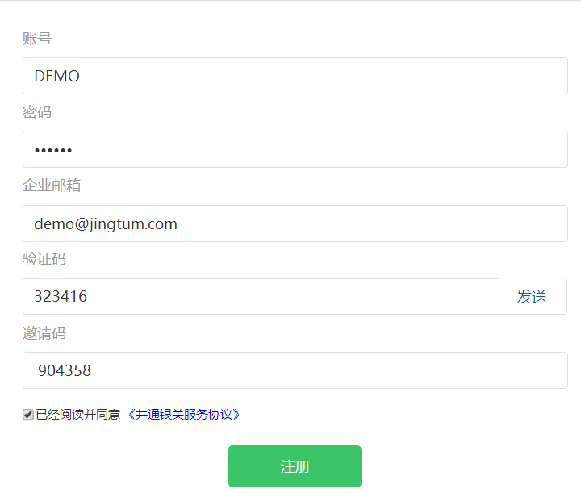
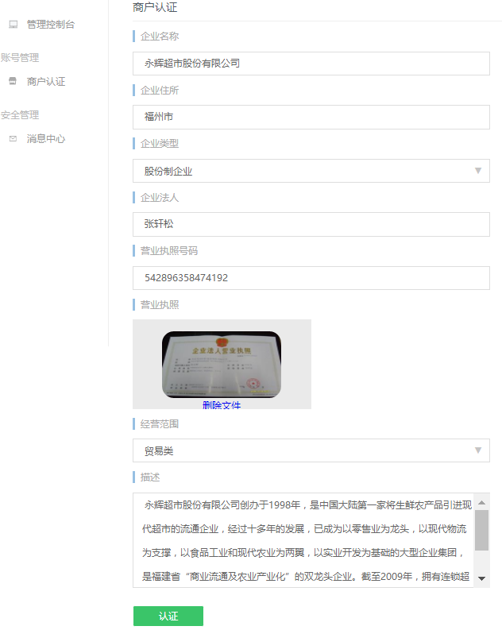
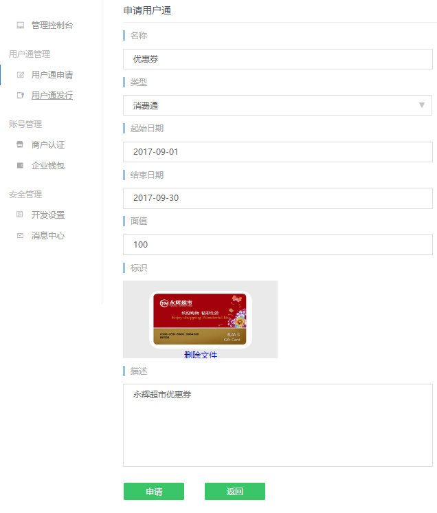
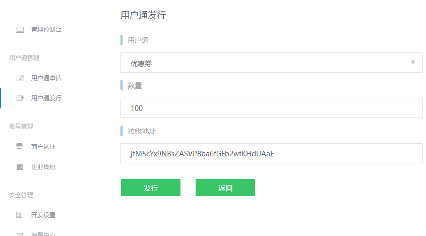

# 接入流程

***

企业和商户需要先在银关上面注册，同意基本的网络使用协议，注册流程如下。

## 第一步，注册企业银关

开立注册中，需求填写商户账号信息，且之后不能修改，同时请同意银关服务条款。

## 第二步，企业银关认证

这一步需要提交企业营业执照等信息以便实施认证。用户需要提供真实可信的企业信息，认证时间大概需要1-2天时间。

## 第三步，企业银关申请资源

认证通过之后，用户会获得一组商户代码和商户密钥，可用于申请通证资源，进行业务流程的构建。 通证的申请可以通过银关上的相应页面进行。

## 第四步，企业银关发行资源

商户可以在银关提供的资源发行界面中进行通证资源的发行。

