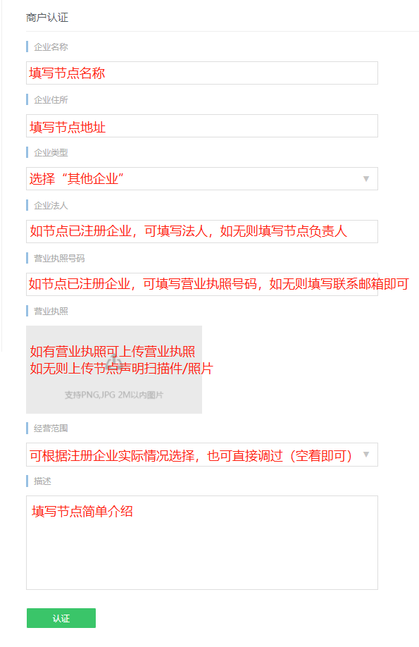
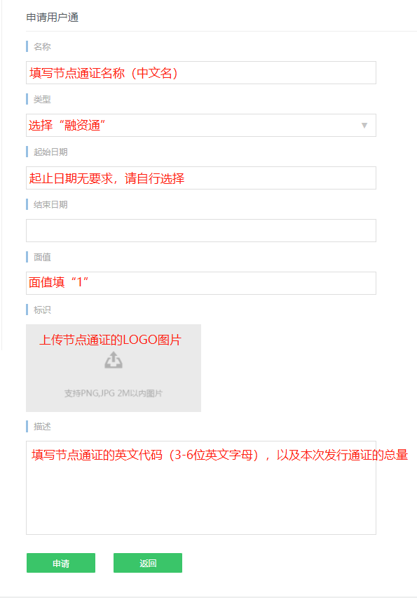

# SWTC公链通证发行申请指引

***

## 一、申请资料

1、通证信息采集表，包括通证名称（代码）、发行数量、通证简介等；

2、通证白皮书，包括项目介绍、项目团队、运营机制、通证分配机制等，可参考通证说明案例；

## 二、申请流程

项目方需要通过节点代为申请发行通证。

1、节点对申请资料审查后，将申请资料发送到SWTC基金会邮箱（service@swtc.top）发起申请；

2、SWTC基金会初审后，将发行申请提交到节点联盟理事会进行审议；

3、发行申请通过后，SWTC基金会协助项目方办理通证发行。

## 三、办理流程

1、发行申请通过后，SWTC基金会将通过邮件向项目方发送邀请码，项目方可使用邀请码自行注册账号。
注册流程如下：

①进入互享网：https://www.sharingnetwork.cn/，点击右上角进行注册

②注册账号后，提交资料进行身份认证，并联系工作人员审核（微信号：175425836）

③通过身份认证后即可申请发行通证，申请时需要填写通证名称、通证类型、起止日期、通证LOGO、通证描述等信息，提交后请联系工作人员后台确认。

④工作人员后台确认后，用户可发行通证，填写发行数量和接收钱包地址，建议填写SWTC钱包的实名地址。

2、发行完毕后，如需在SWTC钱包开通转账功能，请填写SWTC钱包通证资料，并提供资料中要求的LOGO格式文件，将资料和LOGO发送到SWTC钱包运营邮箱：yangzhiqiang@jingtum.com，并抄送SWTC钱包客服邮箱：guxiaohong@jingtum.com，邮件标题中请注明：XX通证开通通证转账功能，工作人员收到邮件后将在一周内进行开通。