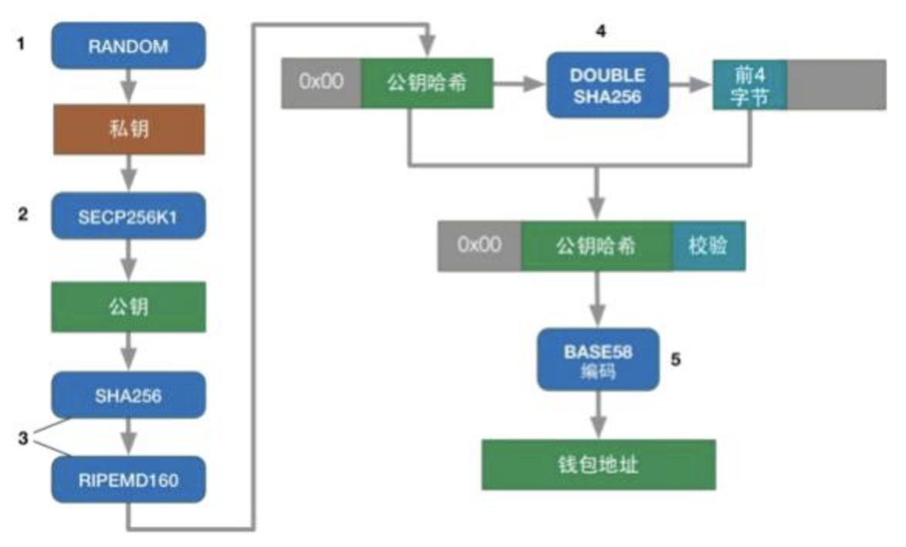

# 账户

***

在SWTC公链的账本中，“账户”代表着包括SWTC在内的资产的持有者和交易的发起者。一个账户由一对私钥和公钥组成。账户的核心要素是：

- 唯一的地址，例如j1gh2NuxKrCxDv67kzs5wsnhqJPGDJarU

- SWTC的余额，每个账户至少要保留一定的SWTC。

- 序列号，从1开始，随着从该账户发起的交易笔数增加而增加。当一个账户发起一笔交易时，该笔交易的序列号需要与其账户的下一个序列号相匹配，否则该笔交易不能被包含在账本中。

- 交易的历史，可以影响本账户的余额。

- 一种或多种授权交易的方式。

在账本所储存的数据中，账户的核心数据存储在AccountRoot账本对象类型中。账户也可以被其他几种类型数据所拥有或部分拥有。

## 创建账户

在SWTC公链中并没有专门的“创建账户”交易。如果给一个有效的、但还没有使用的SWTC地址发送大于等于20个SWTC，那么系统会为其自动创建一个账户。这个过程也可以称为激活账户，同时会在账本中创建AccountRoot对象。

**警告:** 激活账户并不意味着你对该账户的所有权和支配权。拥有该账户地址所对应私钥的人才可以完全控制账户及其所包含的资产。

在SWTC账本中获取账户的方法如下：

1. 从强大的随机源中生成密钥对，并通过该密钥对计算出地址。

2. 让那些拥有SWTC账户的人将SWTC发送到你生成的地址中。

例如，您可以在私人交易所购买SWTC，然后将SWTC从交易所提币到您指定的地址。

**注意:** 第一次在您自己的SWTC账本地址上收到SWTC时，您必须预留一定的账户储备金（当前为20SWTC），这20SWTC将被无限期地锁定。相比较的是，中心化交易所通常将所有客户的SWTC集中保管在一些共享的SWTC账户中，因此客户无需为交易所的个人账户预留储备金。

## 地址

SWTC账本中的账户由base58定义。账户地址来自该账户的公钥，该公钥又来自私钥。地址在JSON中表示为字符串，具有以下特征：

- 长度在25到35个字符之间

- 以字母j开头

- 使用字母数字字符，不包括数字“0”、大写字母“O”、大写字母“I”和小写字母“l”

- 区分大小写

- 包括一个4字节的校验和，以便从随机字符生成有效地址的概率约为2^32

任何有效地址都可以通过获得SWTC来激活从而成为SWTC账本中的账户。只有被激活的账户才能发送交易。

从密钥对开始，创建有效账户地址是一个不可逆的数学过程。你可以完全脱机生成密钥对并计算其地址，而无需与SWTC公链或任何其他方通信。从公钥到地址的转换涉及单向散列函数（Hash），因此可以确认公钥与地址匹配，但是不可能仅从地址反推出公钥。

有关如何计算SWTC账户地址的更多技术细节，请参阅地址编码。

## 账户的持久性

账户一旦创建后，会永远存在于SWTC账本中。根据序列号可永久追踪交易，避免双花问题。

与比特币和许多其他加密货币不同，SWTC账本的每一个新版本都包含账本的完整状态，账本长度随着新账户增加而增加。因此，除非完全有必要，否则SWTC公链不鼓励创建新账户。

## 交易历史

在SWTC账本中，交易历史通过交易的哈希值和账本的索引链接来实现追溯。AccountRoot账本对象拥有哈希值和最近修改它的交易账本。该交易的元数据包含AccountRoot节点先前的状态，因此可以通过这种方式遍历单个账户的历史记录。此交易历史记录包括直接修改AccountRoot节点的所有交易，包括：

- 账户发起的交易，因为他们修改了账户的序列号。因为还存在交易金额和交易费用，这些交易还会修改账户的SWTC余额。

- 修改账户SWTC余额的交易，包括收款付款交易和其他类型的交易。

## 地址编码

SWTC账户地址使用base58和jingtum字典进行编码：`jpshnaf39wBUDNEGHJKLM4PQRST7VWXYZ2bcdeCg65rkm8oFqi1tuvAxyz`。

下图显示了密钥和地址之间的关系：



计算SWTC账户地址的公式如下。有关完整的示例代码，请参阅[`secp256KeyPair.go`](https://github.com/swtcpro/jingtum-lib-go/blob/master/src/jingtumLib/crypto/secp256k1/secp256KeyPair.go)。

```go
    pubBytes := pub.ToBytes()
	
	/* SHA256 Hash */
	sha256H := sha256.New()
	sha256H.Reset()
	sha256H.Write(pubBytes)
	pubHash1 := sha256H.Sum(nil)

	/* RIPEMD-160 Hash */
	ripemd160H := ripemd160.New()
	ripemd160H.Reset()
	ripemd160H.Write(pubHash1)
	pubHash2 := ripemd160H.Sum(nil)
	address = jtUtils.EncodeB58(jtConst.AccountPrefix, pubHash2)
```