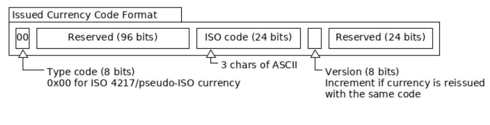

# Currency Codes

SWTC账本中的所有非SWTC货币都有160位currency code。所述jingtum-API的映射3个字符的ASCII字符串（区分大小写），使用的是标准映射160位的货币代码。SWTC不允许使用该currency code。用相同的货币代码可以连接整个trustlines。货币代码没有内置于SWTC账本中的其他行为。

## 标准Currency Codes

标准货币映射按如下方式分配位：

1. 前8位必须是`0x00`。
2. 接下来的96位是保留的，应该全部是0s。
3. 接下来的24位代表ASCII的3个字符。Jingtum建议使用[ISO 4217](http://www.xe.com/iso4217.php)代码或流行的伪ISO 4217代码，例如“BTC”。然而，下面的字符的任意组合被允许：所有大写字母和小写字母，数字，以及符号`?`, `!`, `@`, `#`, `$`, `%`, `^`, `&`, `*`, `<`, `>`, `(`, `)`, `{`, `}`, `[`, `]`, and <code>&#124;</code>。 货币代码SWTC（全大写）保留给SWTC，不能由发行货币使用。
4. 接下来的8位表示货币版本。如果使用不同的值重新发行相同的货币，则可以增加此值以使货币保持独立。
5. 接下来的24位是保留的，应该全部是0s。

## 非标准Currency Codes

您还可以使用160位（40个字符）十六进制字符串（如`015841551A748AD2C1F76FF6ECB0CCCD00000000`货币代码）来发行其他类型的货币。为了防止将其视为不同的货币代码类型，前8位不得为0x00。
